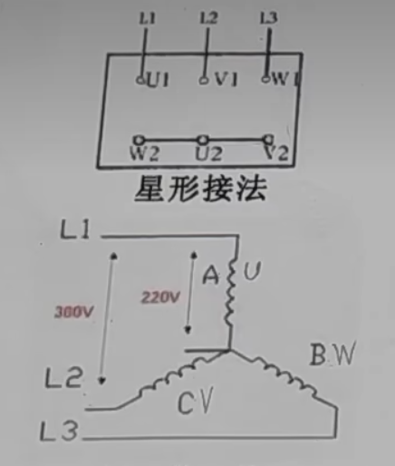
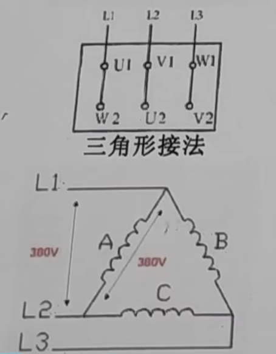
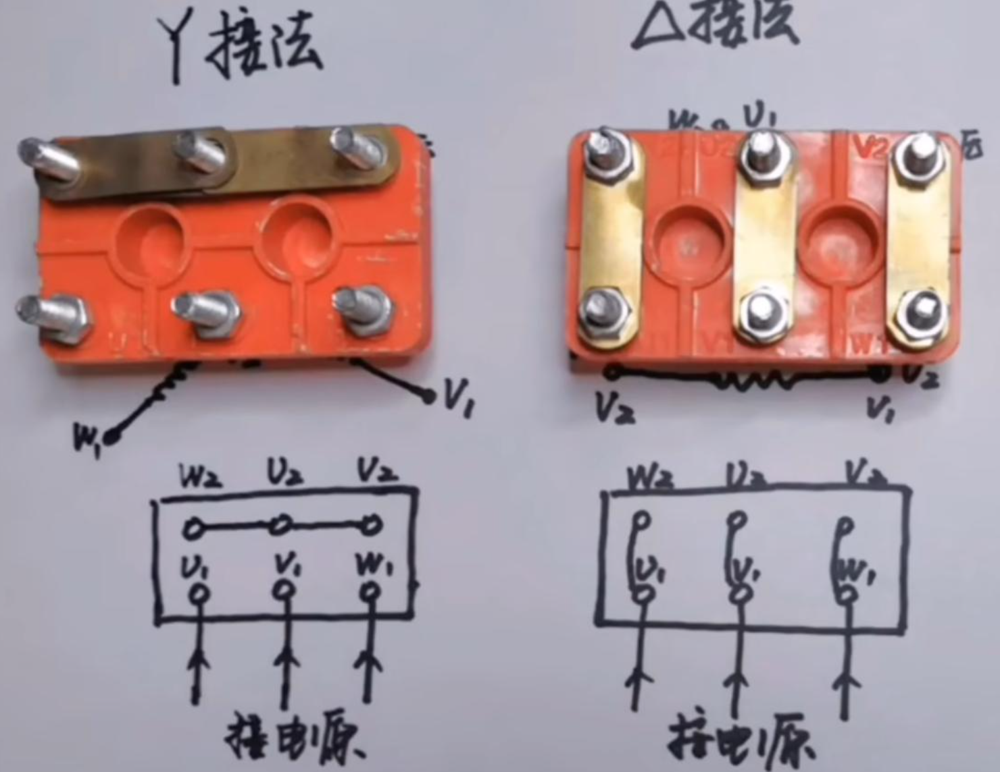
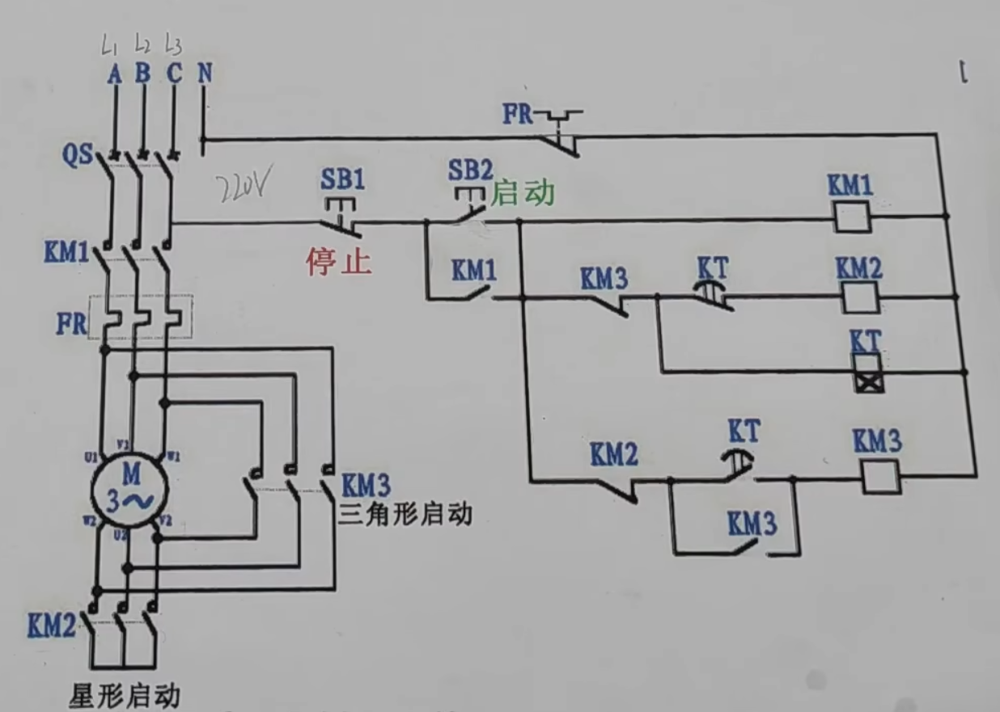
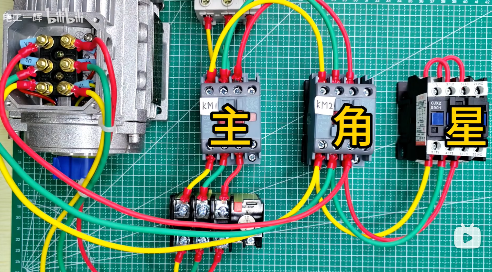
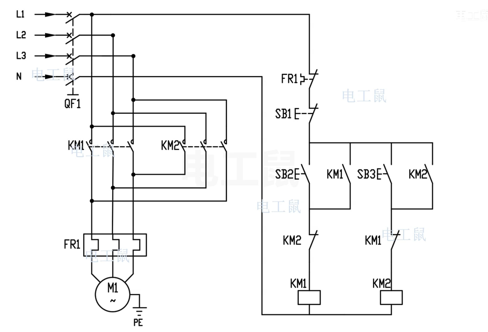
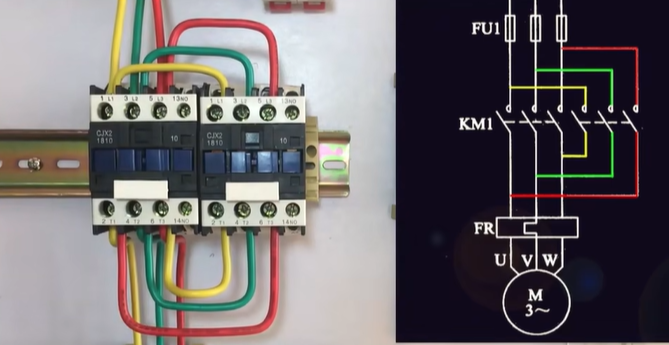

<hr>
title: 电动机相关知识

date: 2026-03-17

tags: 

- 电动机

categories:

- 电工

link: electrical

description: "关于电动机的笔记，仅作为个人见解。"
<hr>
## 电动机

### 1. 星型接法和三角形接法

- 国内电网统一标准：在对称三相交流系统中，线电压（火线→火线）380v，相电压（火线→零线）220v。U线 = √3 × U相  （√3 ≈ 1.732）

#### 1.1.为什么需要降压启动

```
因为电动机启动瞬间电流是额定电流的数倍，会让组网其他电器受影响，启动过后，运行电
流稳定，用星三角降压启动，启动电流是原来的三分之一。
```

#### 1.2.星型接法




```
3个绕组将一端接触，输出220v。星型接法为什么输出220v，
因为三相电压相位互差120°，星型接法 + 引出中性线（三相四线制）时，
U相 = 380 / √3 ≈ 220 V
```


#### 1.3.三角形接法




```
3个绕组首尾相连，输出380v
```

#### 1.4.实物图




#### 1.4.电路图





- 电路图分析

```
ABC是3根火线，N是零线
3根火线接向工作电路，C和N接控制电路

1.按下QS，启动按钮SB2
2.KM1,KM2,KT得电，3根火线上的常开吸合，和SB2并联的常开KM1和线圈KM1自锁形成通路
3.KM2得电后星型启动电动机，常闭KM2断开，KT开始计时
4.KT计时结束，KM2失电，星型断开，KM3得电，和自己的常开形成自锁，三角形接法启动
5.SB1停止电动机

通过上述流程完成星型降压启动，降低启动电流，三角形接法正常工作，稳定输出电流。
```

- 实物接法





### 2.正反转

#### 2.1.电路图




#### 2.2.实物图




